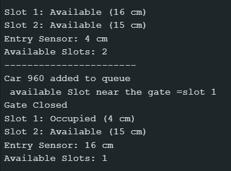

# 🚗 Automatic Gate Control for Smart Parking System using Circular Queue and Min Heap


A smart embedded parking management system that automates **vehicle entry**, **parking slot allocation**, and **gate control** using **Arduino UNO**, **HC-SR04 Ultrasonic Sensors**, and an **SG90 Servo Motor**. The system utilizes a **Circular Queue** for FIFO vehicle management and a **Min Heap** to efficiently allocate the nearest available parking slot.

---

# 📑 Table of Contents

- Project Objectives
- Project Preview
- System Overview
- Tech Stack
- Data Structures Used
- Hardware Connections
- Hardware Components
- Software Requirements
- Project Structure
- Working Principle
- Features
- Applications
- Future Enhancements
- Team Members
- License

---

# 📌 Project Objectives

- Automate parking gate control
- Reduce manual intervention in parking management
- Detect vehicle entry using ultrasonic sensors
- Allocate the nearest available parking slot efficiently
- Manage vehicle flow using FIFO logic
- Display real-time parking status through the Arduino Serial Monitor

---

# 📸 Project Preview

## Hardware Setup


---

## Circuit Diagram


---

## Serial Monitor Output



---

# ⚙️ System Overview

### 🚘 Vehicle Detection

HC-SR04 ultrasonic sensors detect vehicles approaching the entrance gate and continuously monitor parking slot occupancy.

### 🚦 Vehicle Queue Management

Incoming vehicles are maintained using a **Circular Queue**, ensuring **First-In-First-Out (FIFO)** processing.

### 🅿️ Smart Slot Allocation

A **Min Heap** maintains the available parking slots and allocates the nearest free slot.

### 🚪 Automatic Gate Control

The SG90 Servo Motor controls the parking gate.

- Opens when parking is available.
- Remains closed when all slots are occupied.

### 📟 Real-Time Monitoring

The Arduino continuously updates parking slot status through the **Serial Monitor**.

---

# 💻 Tech Stack

- Arduino UNO
- Arduino IDE
- Arduino C / Embedded C
- HC-SR04 Ultrasonic Sensors
- SG90 Servo Motor
- Serial Monitor

---

# 🧠 Data Structures Used

## Circular Queue

Used for:

- FIFO vehicle management
- Managing waiting vehicles
- Preventing queue overflow

## Min Heap

Used for:

- Efficient nearest-slot allocation
- Fast retrieval of available parking slots
- Optimized parking management

---

# 🔌 Hardware Connections

| Component | Arduino Pin |
|-----------|------------:|
| Entry Sensor TRIG | D2 |
| Entry Sensor ECHO | D3 |
| Slot 1 Sensor TRIG | D4 |
| Slot 1 Sensor ECHO | D5 |
| Slot 2 Sensor TRIG | D6 |
| Slot 2 Sensor ECHO | D7 |
| Slot 3 Sensor TRIG | D8 |
| Slot 3 Sensor ECHO | D9 |
| Servo Motor Signal | D10 |
| VCC | 5V |
| GND | GND |

> **Note:** Update the pin numbers if your implementation uses different Arduino pins.

---

# 🛠 Hardware Components

- Arduino UNO
- HC-SR04 Ultrasonic Sensors
- SG90 Servo Motor
- Breadboard
- Jumper Wires
- USB Cable

---

# 💻 Software Requirements

- Arduino IDE
- Arduino C / Embedded C

---

# 📂 Project Structure

```text
automatic-gate-control-for-smart-parking-system/
│
├── assets/
│   └── circuit_diagram.png
│
├── Code/
│
├── Hardware-setup/
│   ├── Circuit-Setup/
│   └── Components-Used/
│
├── Serial-Monitor-Output/
│
├── README.md
│
└── LICENSE
```

---

# 🔄 Working Principle

1. Vehicle approaches the entrance gate.
2. Entry ultrasonic sensor detects the vehicle.
3. System checks parking slot availability.
4. Vehicle is added to the Circular Queue.
5. Min Heap identifies the nearest available parking slot.
6. Servo motor opens the gate.
7. Vehicle parks in the allocated slot.
8. Slot occupancy is updated.
9. Current parking status is displayed on the Serial Monitor.

---

# 🎯 Features

- Automatic gate control
- Smart nearest-slot allocation
- FIFO vehicle management
- Real-time parking occupancy monitoring
- Efficient parking slot allocation using Min Heap
- Low-cost embedded implementation
- Scalable parking management solution

---

# 📌 Applications

- Smart Parking Systems
- Shopping Malls
- Hospitals
- Educational Institutions
- Residential Apartments
- Smart City Infrastructure

---

# 🔮 Future Enhancements

- RFID-based vehicle authentication
- Mobile application integration
- Cloud-based parking monitoring
- Automatic payment system
- Number plate recognition
- IoT-based remote monitoring

---

# 👨‍💻 Team Members

- **Mounidharan V**
- **Guna S**
- **Thirulogasundar S**

---

# 📜 License

This project was developed for **academic and educational purposes**.

---

⭐ **If you found this project useful, consider giving it a ⭐ on GitHub!**
